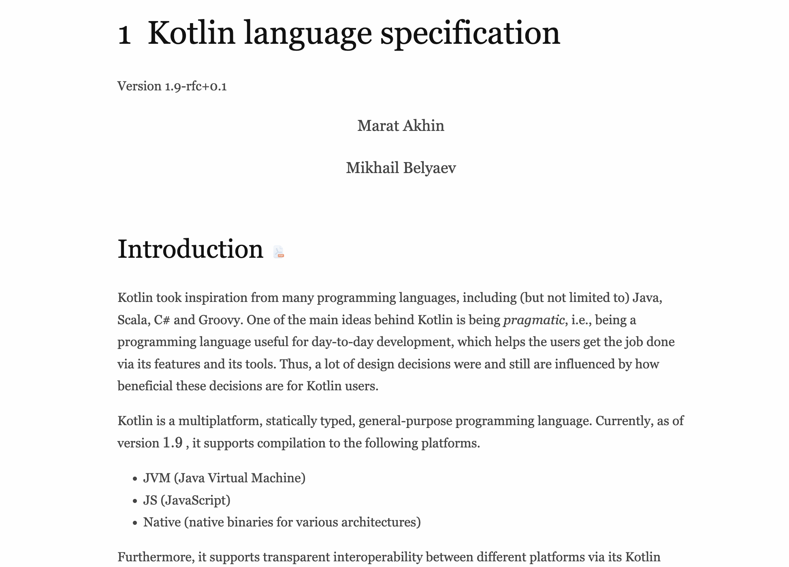

<!-- {"layout": "title"} -->

# Kotlin言語仕様書への招待

## 〜コードの「なぜ」を読み解く〜

## Kotlin Fest 2025 @東京コンファレンスセンター品川

---

<!-- {"layout": "agenda"} -->

# アジェンダ

1. 自己紹介
1. Kotlin言語仕様書の概要
1. 言語仕様書の読み方 
1. 課題解決の実例1
1. 課題解決の実例2
1. 課題解決の実例3（応用）
1. 会社紹介？
1. まとめ

---

<!-- {"layout": "eye-catch"} -->

# 🐾 1. 自己紹介 🐾

---

<!-- {"layout": "self-introduction"} -->

# 自己紹介

## ▼ 名前　

本田 雄亮

## ▼ 所属企業　

LINE Digital Frontier株式会社

## ▼ Xアカウント　

@yyh_gl


---

<!-- {"layout": "eye-catch"} -->

# 🐾 2. Kotlin言語仕様書の概要 🐾

---

# 「言語仕様書」とは

言語仕様書はプログラミング言語の文法や動作といった言語仕様が記述された
ドキュメント。

様々なプログラミング言語で言語仕様書が公開されている。




---

# Kotlin Language Specification

Kotlin Language Specification（Kotlin言語仕様書）は[Kotlinの公式サイト](https://kotlinlang.org/)で
公開されている。
→ [https://kotlinlang.org/spec](https://kotlinlang.org/spec)
<br>

内容はGitHubで管理されている。
仕様策定から修正提案まで、誰でも参加可能。
→ [https://github.com/Kotlin/kotlin-spec](https://github.com/Kotlin/kotlin-spec)

---

# 言語仕様書以外にも…

[Kotlinの公式サイト](https://kotlinlang.org/docs/home.html)には、言語仕様書以外にもたくさんのドキュメントが
存在する。
チュートリアルに始まり、文法や標準ライブラリの説明など
様々なドキュメントが用意されている。


---

# 他ドキュメントとの違い

[Kotlin/kotlin-spec](https://github.com/Kotlin/kotlin-spec)リポジトリのREADMEに以下の記述がある。

原文:
\> This repository contains the specification of the Kotlin programming language,
\> which describes how parts of the language should function in more detail,
\> as compared to a more traditional user documentation on the Kotlin Website.

日本語訳:
\> このリポジトリにはプログラミング言語 Kotlinの仕様が含まれており、
\> Kotlinの公式サイトにある従来のユーザードキュメントと比較して、
\> 言語の各部分がどのように機能するかをより詳細に説明しています。

---

# 言語仕様書を読むメリット

<!-- {"layout": "title-and-body-and-conclusion"} -->

原文:
\> It would be most useful to those who are interested
\> in how Kotlin works on a finer level and how its features interoperate,
\> e.g., language enthusiasts, compiler writers and Kotlin power-users.
\> However, if you are simply wondering,
\> why some code you wrote works the way it does,
\> this specification might help you get an answer to that.

日本語訳:
\> 言語仕様書は、Kotlinの詳細な動作や機能の相互運用に興味がある人々、
\> 例えば、言語愛好家、コンパイラの開発者、Kotlinの上級ユーザーにとって最も有用です。
\> しかし、単に自分が書いたコードがなぜそのように動作するのか疑問に思っている場合、
\> この仕様書がその答えを見つけるのに役立つかもしれません。

## より詳細な仕様を知るさいに参照すべきドキュメント

---

# 言語仕様書を読むメリット

<!-- {"layout": "title-and-body-and-conclusion"} -->

原文:
\> It would be most useful to those who are interested
\> in how Kotlin works on a finer level and how its features interoperate,
\> e.g., language enthusiasts, compiler writers and Kotlin power-users.
\> However, if you are simply wondering,
\> why some code you wrote works the way it does,
\> this specification might help you get an answer to that.

日本語訳:
\> 言語仕様書は、Kotlinの詳細な動作や機能の相互運用に興味がある人々、
\> 例えば、言語愛好家、コンパイラの開発者、Kotlinの上級ユーザーにとって最も有用です。
\> しかし、単に自分が書いたコードがなぜそのように動作するのか疑問に思っている場合、
\> この仕様書がその答えを見つけるのに役立つかもしれません。

## より詳細な仕様を知るさいに参照すべきドキュメント

<!-- プログラミング言語が好き、Kotlinが好きという人は -->
<!-- 一度読んでみることをおすすめします！ -->
<!-- 「こんな書き方できたんだ」 -->
<!-- 「こんな機能があったんだ」 -->
<!-- 新しい発見にきっと繋がります -->

---

# Kotlin言語仕様書の注意点

現在のKotlin言語仕様書は、v1.9までの内容に対応している。
※ 2025年11月1日時点の最新バージョンはv2.2.20
<br>

Kotlin開発チームのリソースが足りておらず、2系に対応した仕様書を作成できていない状況。
[https://github.com/Kotlin/kotlin-spec/issues/137](https://github.com/Kotlin/kotlin-spec/issues/137)

---

<!-- {"layout": "eye-catch"} -->

# 🐾 言語仕様書の読み方 🐾

---

# 文法の形式的表現

「形式的表現」とは、こう書けば、こういう動作（結果）になる、というルールを表現するためのもの。

Kotlin言語仕様書では、文法の形式的表現として[EBNF](https://ja.wikipedia.org/wiki/EBNF)ベースの記法が
採用されている。

EBNFはプログラミング言語の文法を表現するための代表的な方法のひとつ。
[Goの言語仕様書](https://go.dev/ref/spec)でも採用されている。

---

<!-- {"layout": "title-and-body-and-code"} -->

# 例： for文の形式的表現

みなさんご存知のfor構文

```kotlin
for (i in 1 .. 10) {
    println(i)
}
```

---

<!-- {"layout": "title-and-body-and-code"} -->

# 例： for文の形式的表現

EBNFベースの形式的表現では以下のようになる。
[該当スペック](https://kotlinlang.org/spec/statements.html#for-loop-statements)

```ebnf
'for'
{NL}
'('
{annotation}
(variableDeclaration | multiVariableDeclaration)
'in'
expression
')'
{NL}
[controlStructureBody]
```

---

# for文の形式的表現を読み解く

- {NL}：改行が0回以上繰り返される
- {annotation}：アノテーションが0回以上繰り返される
- (variableDeclaration | multiVariableDeclaration)：variableDeclarationまたはmultiVariableDeclarationのどちらか
  - variableDeclaration：変数宣言
  - multiVariableDeclaration：複数変数宣言
- expression：式
- [controlStructureBody]：controlStructureBodyが0回または1回

```ebnf
'for'
{NL}
'('
{annotation}
(variableDeclaration | multiVariableDeclaration)
'in'
expression
')'
{NL}
[controlStructureBody]
```

---

# for文の形式的表現を読み解く

先ほどのfor文ではいくつかの部分が省略されている。
使用されているのは以下のふたつ。

- variableDeclaration：変数宣言
- expression：式

```ebnf
'for'
{NL}
'('
{annotation}
(variableDeclaration | multiVariableDeclaration)
'in'
expression
')'
{NL}
[controlStructureBody]
```

```kotlin
for (i in 1 .. 10) {
    println(i)
}
```

---

# for文の形式的表現を読み解く

省略可能な部分も省略せずにコードを書いてみる。

```ebnf
'for'
{NL}
'('
{annotation}
(variableDeclaration | multiVariableDeclaration)
'in'
expression
')'
{NL}
[controlStructureBody]
```

```kotlin
for
(@Suppress("UNUSED_VARIABLE") i in 1..10)
{
    println(i)
}
```

---

# 形式的表現のまとめ

Kotlin言語使用書ではEBNFベースの形式的表現を使用して
利用可能な文法を説明している。
<br>

EBNFは慣れないと読みづらい。

とはいえ、LLMを使えば形式的表現をコードに高精度で変換してくれる。
LLMが出してくれたコードを参考にしつつ、形式的表現を読み解いていけばよい。

---

<!-- {"layout": "eye-catch"} -->

# 🐾 言語仕様書の読み方 🐾

## もう少しだけ

---

# あると良い知識

<!-- TODO この後で扱わないのであれば消していいかも -->

Kotlin言語使用書を読むにあたり数学の知識があると理解が捗る。
一例として以下の記号が登場する。

- `∀`（全称記号）
  - 「すべての」という意味
  - e.g. `∀x:x²>1` は「すべてのxについて`x²>1`が成り立つ」という意味
- `∃`（存在記号）
  - 「少なくともひとつは存在する」という意味
  - e.g. `∃x:x²=4` は「`x²=4`が成り立つxが少なくともひとつは存在する」という意味
- `∈`（属する）
  - 「属する」という意味
  - e.g. `x∈A` は「xはAに属する」という意味

数学が苦手でもLLMのサポートを受けながら読めば結構理解できる。

---

<!-- {"layout": "eye-catch"} -->

# 🐾 課題解決の実例1 🐾

---

<!-- {"layout": "eye-catch"} -->

# 🐾 課題解決の実例2 🐾

---

<!-- {"layout": "eye-catch"} -->

# 🐾 課題解決の実例3 🐾

---

<!-- {"layout": "eye-catch"} -->

# 🐾 会社紹介 🐾

---

<!-- {"layout": "eye-catch"} -->

# 🐾 まとめ 🐾

---

# 振り返り

- Kotlin言語仕様書を紹介
  - 概要
  - 読むメリット
  - 読み方
- Kotlinの特徴的な仕様をいくつか紹介
  - ケース1
  - ケース2
  - ケース3

---

# 終わりのあいさつ

Kotlinの特徴的な仕様書を例に、内部動作を説明しました。

本発表を聞いて「こんなことできたんだ！」「こういう挙動だったんだ！」という新しい発見があると嬉しいです。
そして、みなさんが言語仕様書を読んでみようかなと思ってもらえたなら、本発表の目的は果たせました。
（まずは積読でもいいので！）

極論、言語内部の細かい動作を知らなくてもコードは書けます。
でも、知っているとプラスに働く要素がたくさんあります。
なにより知識探求はおもしろいです。

TBD

---

# memomemo

- まずは流し見することをおすすめする
- LLMに投げて、まずは概要を掴むのがおすすめ
- 数学の知識が必要になってくる
