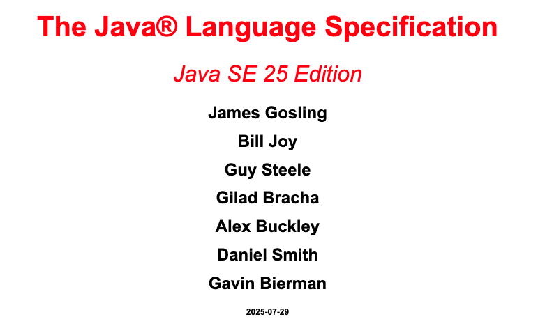
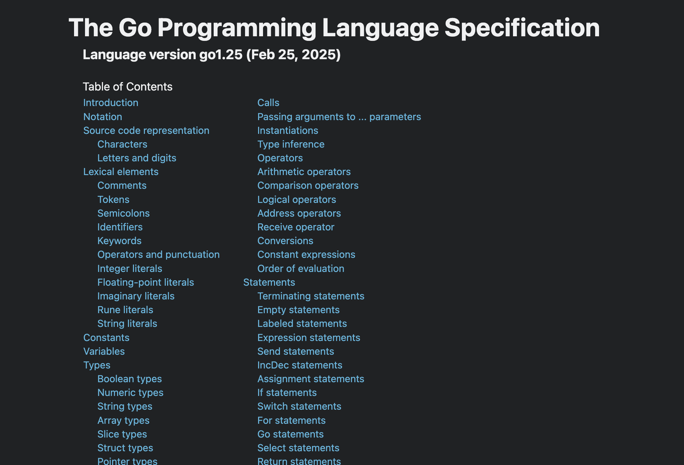
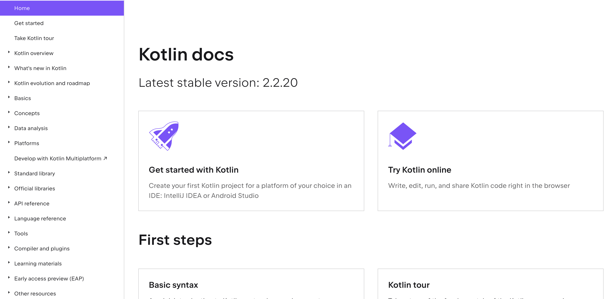
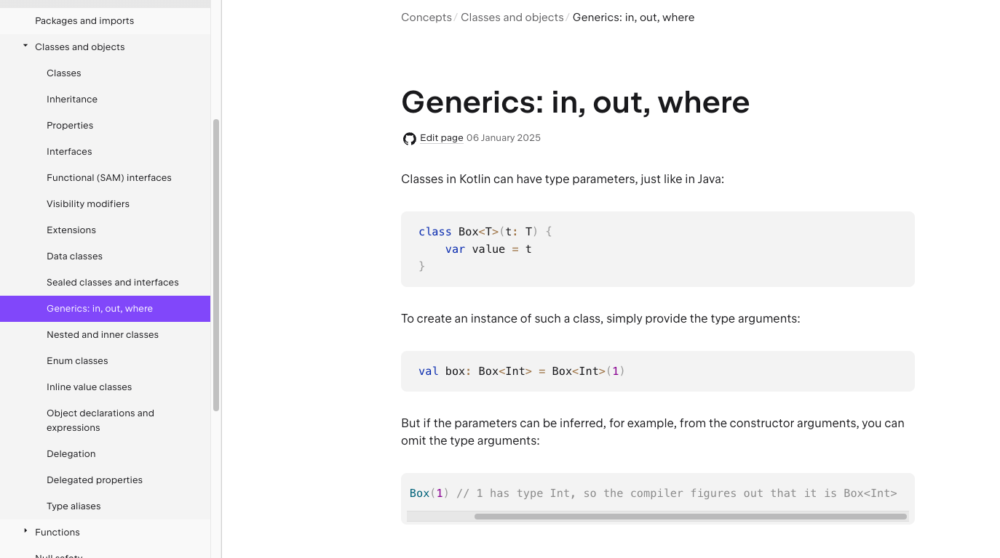

<!-- {"layout": "title"} -->

# Kotlin言語仕様書への招待

## 〜コードの「なぜ」を読み解く〜

## Kotlin Fest 2025 @東京コンファレンスセンター品川

---

<!-- {"layout": "eye-catch"} -->

# 🐾 1. 自己紹介 🐾

## はじめまして

---

<!-- {"layout": "self-introduction"} -->

# 自己紹介

## ▼ 名前　

本田 雄亮

## ▼ 所属企業　

LINE Digital Frontier株式会社

## ▼ Xアカウント　

@yyh_gl


<!-- https://x.com/yyh_gl -->

---

<!-- {"layout": "eye-catch"} -->

# 🐾 会社紹介 🐾

---

# LINE Digital Frontier株式会社

『LINEマンガ』を開発しています📚️

みなさまのおかげで5500万DLを突破！
2025年上半期には、日本のすべてのアプリのなかで収益ランキング1位を達成🥇


<!-- https://ldfcorp.com/ -->

---

<!-- {"layout": "agenda"} -->

# アジェンダ

1. Kotlin言語仕様書の概要
1. 言語仕様書の読み方
1. 仕様解説
   1. Type System & Built-in types
   1. Overload resolution
1. 「へぇ〜」な仕様紹介
1. まとめ

---

# 謝辞｜Acknowledgments

本発表の資料作成にあたり
貴重なアドバイスをいただいたJetBrains社のMarat Akhin氏、
ならびに発表練習にお付き合いいただいたLINE Digital Frontier社の
同僚の皆様に心より感謝申し上げます。
（犬の絵を描いてくれた妻にも）<br>

I would like to thank Marat Akhin of JetBrains for his valuable advice
for this presentation and my colleagues at LINE Digital Frontier
for their support with the presentation practice.
(Also, my wife for drawing the dog illustrations.)

---

<!-- {"layout": "title-and-body-and-dog-comment"} -->

# サンプルコードおよび参考資料

本発表で使用するサンプルコード（Kotlin Playgroundのリンク）や
参考資料のリンクはスライドのスピーカーノートに記載しています。

お好きなタイミングでご参照ください。

## PlaygroundがWebで提供されている言語大好き

---

<!-- {"layout": "eye-catch"} -->

# 🐾 2. Kotlin言語仕様書の概要 🐾

---

# 「言語仕様書」とは

言語仕様書はプログラミング言語の文法や動作といった言語仕様が
記述されたドキュメント。

様々なプログラミング言語で言語仕様書が公開されている。




<!-- https://docs.oracle.com/javase/specs/jls/se25/html/index.html -->
<!-- https://go.dev/ref/spec -->

---

# Kotlin Language Specification

Kotlin Language Specification（Kotlin言語仕様書）は[Kotlinの公式サイト](https://kotlinlang.org/)で
公開されている。
→ [https://kotlinlang.org/spec](https://kotlinlang.org/spec)<br>

内容はGitHubで管理されている。
仕様策定から修正提案まで、誰でも参加可能。
→ [https://github.com/Kotlin/kotlin-spec](https://github.com/Kotlin/kotlin-spec)

---

# 言語仕様書以外にも…

[Kotlinの公式サイト](https://kotlinlang.org/docs/home.html)には、言語仕様書以外にもたくさんのドキュメントが
存在する。
チュートリアルに始まり、文法や標準ライブラリの説明など
様々なドキュメントが用意されている。



<!-- https://kotlinlang.org/docs/home.html -->

---

<!-- {"layout": "title-and-body-and-conclusion"} -->

# 他ドキュメントとの違い

[Kotlin/kotlin-spec](https://github.com/Kotlin/kotlin-spec)リポジトリのREADMEに以下の記述がある。

原文:
\> This repository contains the specification of the Kotlin programming language,
\> which describes how parts of the language should function in more detail,
\> as compared to a more traditional user documentation on the Kotlin Website.

日本語訳:
\> このリポジトリにはプログラミング言語 Kotlinの仕様が含まれており、
\> Kotlinの公式サイトにある従来のユーザードキュメントと比較して、
\> 言語の各部分がどのように機能するかをより詳細に説明しています。

## 言語仕様書はより詳細な仕様を知るさいに参照すべきドキュメント

---

# みんなに読んでほしい言語仕様書

原文:
\> It would be most useful to those who are interested
\> in how Kotlin works on a finer level and how its features interoperate,
\> e.g., language enthusiasts, compiler writers and Kotlin power-users.
\> However, if you are simply wondering,
\> why some code you wrote works the way it does,
\> this specification might help you get an answer to that.

日本語訳:
\> 言語仕様書は、Kotlinの詳細な動作や機能の相互運用に興味がある人々、
\> 例えば、言語愛好家、コンパイラの開発者、Kotlinの上級ユーザーにとって最も有用です。
\> しかし、**単に自分が書いたコードがなぜそのように動作するのか疑問に思っている場合、
\> この仕様書がその答えを見つけるのに役立つかもしれません。**

---

# みんなに読んでほしい言語仕様書

原文:
\> It would be most useful to those who are interested
\> in how Kotlin works on a finer level and how its features interoperate,
\> e.g., language enthusiasts, compiler writers and Kotlin power-users.
\> However, if you are simply wondering,
\> why some code you wrote works the way it does,
\> this specification might help you get an answer to that.

日本語訳:
\> 言語仕様書は、Kotlinの詳細な動作や機能の相互運用に興味がある人々、
\> 例えば、言語愛好家、コンパイラの開発者、Kotlinの上級ユーザーにとって最も有用です。
\> しかし、**単に自分が書いたコードがなぜそのように動作するのか疑問に思っている場合、
\> この仕様書がその答えを見つけるのに役立つかもしれません。**

<!-- プログラミング言語が好き、Kotlinが好きという方は -->
<!-- 一度読んでみることをおすすめします！ -->
<!-- 「こんな書き方できたんだ」 -->
<!-- 「こんな機能があったんだ」 -->
<!-- 新しい発見にきっと繋がります -->

---

# Kotlin言語仕様書の注意点①

現在のKotlin言語仕様書は、v1.9までの内容に対応している。
※ 2025年11月1日時点の最新バージョンはv2.2
<br>

Kotlin開発チームのリソースが足りておらず
2系に対応した仕様書を作成できていない状況。
[https://github.com/Kotlin/kotlin-spec/issues/137](https://github.com/Kotlin/kotlin-spec/issues/137)

---

# Kotlin言語仕様書の注意点②

Kotlinは複数のプラットフォームをサポートするマルチプラットフォーム言語。
Kotlinはv1.9時点では下記マルチプラットフォームへのコンパイルをサポート。

- JVM
- JavaScript
- Android

v2.2時点では以下のプラットフォームもあわせてサポート。

- Wasm
- Scripting

<!-- https://kotlinlang.org/spec/introduction.html#introduction -->
<!-- https://kotlinlang.org/docs/jvm-get-started.html -->

---

<!-- {"layout": "title-and-body-and-dog-comment"} -->

# Kotlin言語仕様書の注意点②

[Kotlin言語仕様書](https://kotlinlang.org/spec)が対象としているのは**Kotlin/Core**の部分。

Kotlin/Coreはプラットフォームに関わらず*ほぼ*同様に機能する
Kotlinのコア部分。

## 「ほぼ」…？

---

# Kotlin言語仕様書の注意点②

**プラットフォームによっては仕様書と異なる実装が存在するので注意が必要。**

[16.1 Catching exceptions](https://kotlinlang.org/spec/exceptions.html#catching-exceptions)には以下の記述がある。

\> the applicability check is subject to Kotlin runtime type information limitations and
\> **may be dependent on the platform implementation of runtime type information,**
\> **as well as the implementation of exception classes**.
\> 適用性チェックはKotlinのランタイム型情報の制限の影響を受ける可能性があり、
\> **プラットフォームのランタイム型情報の実装や例外クラスの実装に依存する場合があります**。
<br>

本発表でサンプルコードを示すときは、
基本的にJVMプラットフォームの仕様に準拠したコードを記載する。

---

<!-- {"layout": "eye-catch"} -->

# 🐾 言語仕様書の読み方 🐾

<!-- time: 7:20 -->

---

# 文法の表現

文法を表現する方法はいくつかある。
Kotlin言語仕様書は、文法の表現方法として[EBNF](https://ja.wikipedia.org/wiki/EBNF)ベースの表記法を採用。

EBNFはプログラミング言語の文法を表現するための代表的な方法のひとつ。
[Goの言語仕様書](https://go.dev/ref/spec)でも採用されている。

<!-- https://docs.python.org/3/reference/introduction.html -->

---

<!-- {"layout": "title-and-body-and-dog-comment"} -->

# 例： for文の文法

広く知られているfor文を例にEBNFベースの表記法を見る。

```kotlin
for (i in 1 .. 10) {
    println(i)
}
```

<!-- https://pl.kotl.in/BlpjuDC3B -->

## よく見るコードだ

---

<!-- {"layout": "title-and-body-and-code"} -->

# 例： for文の文法

for文をEBNFベースの表記法で表現すると以下のようになる。

```ebnf
'for'
{NL}
'('
{annotation}
(variableDeclaration | multiVariableDeclaration)
'in'
expression
')'
{NL}
[controlStructureBody]
```

<!-- https://kotlinlang.org/spec/statements.html#for-loop-statements -->

---

<!-- {"layout": "title-and-body-without-dog"} -->

# for文の表記法を読み解く

- {NL}：改行が0回以上繰り返される
- {annotation}：アノテーションが0回以上繰り返される
- (variableDeclaration | multiVariableDeclaration)：<br>　　variableDeclarationまたはmultiVariableDeclarationのどちらか
  - variableDeclaration：変数宣言
  - multiVariableDeclaration：複数変数宣言
- expression：式
- [controlStructureBody]：<br>　　制御構造の本体が<br>　　0個または1個

```ebnf
'for'
{NL}
'('
{annotation}
(variableDeclaration | multiVariableDeclaration)
'in'
expression
')'
{NL}
[controlStructureBody]
```

---

<!-- {"layout": "title-and-body"} -->

# for文の表記法を読み解く

EBNFベースの表記法を例であげたfor文と比較しながら解説。

```ebnf
'for'
{NL}
'('
{annotation}
(variableDeclaration | multiVariableDeclaration)
'in'
expression
')'
{NL}
[controlStructureBody]
```

```kotlin
for (i in 1 .. 10) {
    println(i)
}
```

---

# for文の表記法を読み解く

省略可能な部分も省略せずにコードを書いてみる。

```ebnf
'for'
{NL}
'('
{annotation}
(variableDeclaration | multiVariableDeclaration)
'in'
expression
')'
{NL}
[controlStructureBody]
```

```kotlin
for
(@Suppress("UNUSED_VARIABLE") i in 1..10)
{
    println(i)
}
```

<!-- https://pl.kotl.in/qa_rygCfJ -->

---

<!-- {"layout": "title-and-body-and-dog-comment"} -->

# EBNFベースの表記法

EBNFは慣れないと読みづらい。<br>

とはいえ、生成AIを使えばEBNFベースの表記法をコードに高精度で
変換してくれる。
生成AIが出してくれたコードを参考にしつつEBNFベースの表記法を
読み解いていけばよい。

## AI時代に感謝

---

<!-- {"layout": "eye-catch"} -->

# 🐾 言語仕様書の読み方 🐾

## もう少しだけ

<!-- time: 12:40 -->

---

# あると良い知識

仕様は数学的表現を使って説明されている。
例えば、数学記号で言うと以下のものが登場する。

- `∀`（全称記号）
  - 「すべての」という意味
  - e.g. `∀x:P(x)` は「すべての`x`について`P(x)`が真である」という意味
- `∃`（存在記号）
  - 「少なくともひとつは存在する」という意味
  - e.g. `∃x:x²=4` は「`x²=4`が成り立つxが少なくともひとつは存在する」という意味
- `∈`（属する）
  - 「属する」という意味
  - e.g. `x∈A` は「xはAに属する」という意味

数学が苦手でも生成AIのサポートを受けながら読めば結構理解できる。

---

# サポートドキュメント

一部の仕様については[Kotlinの公式サイト](https://kotlinlang.org/docs/home.html)でも説明している。
[Kotlinの公式サイト](https://kotlinlang.org/docs/home.html)の方が初心者にもわかりやすい内容になっている。
あわせて読むと理解が捗る。



---

<!-- {"layout": "eye-catch"} -->

# 🐾 ここまでの話を整理 🐾

<!-- time: 13:48 -->

---

# ここまでの話を整理

Kotlin言語仕様書は

- EBNFベースの表記法により文法を定義
- 数学的表現を使って仕様を説明

難しい内容もあるが、生成AIや他の公式ドキュメントが理解を助けてくれる。<br>

次ページからは、EBNFベースの表記法や数学的表現を読み解くことで
どういった知識を得ることができるのか紹介&解説。

---

<!-- {"layout": "eye-catch"} -->

# 🐾 仕様解説 🐾

## 言語仕様書の内容をいくつか共有

---

<!-- {"layout": "eye-catch"} -->

# 🐾 Type System & Built-in types 🐾

## 型システム & 組み込み型

<!-- https://kotlinlang.org/spec/type-system.html#type-system -->
<!-- https://kotlinlang.org/spec/built-in-types-and-their-semantics.html#built-in-types-and-their-semantics -->

---

# 疑問

型を定義したとき、自分で実装した覚えのない`equals`メソッドが
使えるのはなぜ？

```kotlin
class Sample

val sample = Sample()
println(sample.equals(1))
```

<!-- https://pl.kotl.in/ndJp5-vBS -->

---

# 答え

`Sample`クラスは暗黙的に`kotlin.Any`を継承しており、
`kotlin.Any`で定義された`equals`メソッドを使っている。

明示的に書けばこういうこと。

```kotlin
class Sample: Any()

val sample = Sample()
println(sample.equals(1))
```

---

# 解説

Kotlinの型システムにおいて`kotlin.Any`は特殊な役割を持っており
すべての非null型のスーパークラスである。
（すべての非null型は暗黙的に`kotlin.Any`を継承している）

`kotlin.Any`は以下のメソッドを提供することが仕様として決まっている。

```kotlin
public open operator fun equals(other: Any?): Boolean
public open fun hashCode(): Int
public open fun toString(): String
```

<!-- https://kotlinlang.org/spec/type-system.html#kotlin.any-typesystem -->
<!-- https://kotlinlang.org/spec/type-system.html#built-in-types -->

---

# 解説

さきほどのサンプルコードにおける`equals`メソッドは
`kotlin.Any`から継承した関数。

実際、IDEやエディタで`equals`メソッドの定義元を参照すると
`kotlin.Any`の定義に飛ぶ。

```kotlin
class Sample

val sample = Sample()
println(sample.equals(1))
```

<!-- https://kotlinlang.org/docs/equality.html#structural-equality -->

---
<!-- {"layout": "eye-catch"} -->

# 🐾 Overload resolution 🐾

## オーバーロード解決

<!-- time: 17:00 -->

---

<!-- {"layout": "title-and-body-without-dog"} -->

# 疑問

オーバーロードに慣れ親しんでいる人からすれば当たり前の実行結果だが
Kotlinはどのように実行する関数を判断している？

```kotlin
// (1)
fun print(value: Any) {
    println("Any: $value")
}

// (2)
fun print(value: String) {
    println("String: $value")
}

// (3)
fun print(value: Int) {
    println("Int: $value")
}
```

```kotlin
fun main() {
    print(3.14)    // (1)が実行されて`Any: 3.14`と出力される
    print("Hello") // (2)が実行されて`String: Hello`と出力される
    print(42)      // (3)が実行されて`Int: 42`と出力される
}
```

<!-- https://pl.kotl.in/IKAIXEzWb -->

---

# 答え

Kotlinは以下のプロセスで実行する関数を選択。

1. オーバーロード候補リスト（overload candidate set, OCS）を構築
2. 1のリストの中から最も具体的な関数を選択
<br>

「最も具体的な関数」……？

---

# 最も具体的な関数の選択

まずはイメージを掴むためにざっくりとした考え方を説明。

`charSequenceVal`および`stringVal`という値について
`funcWithCharSequence`関数はどちらの値も引数に取れる。
（String型はCharSequenceインタフェースを満たす）
※実際はオーバーロード候補になりえないペアだがイメージとして例示

```kotlin
fun funcWithCharSequence(value: CharSequence) { TODO() }
fun funcWithString(value: String) { TODO() }
```

```kotlin
val charSequenceVal: CharSequence = "hoge"
val stringVal: String = "hoge"
funcWithCharSequence(charSequenceVal) // OK
funcWithCharSequence(stringVal)       // OK
```

<!-- https://kotlinlang.org/spec/overload-resolution.html#choosing-the-most-specific-candidate-from-the-overload-candidate-set -->
<!-- https://pl.kotl.in/zOPx2jP8Z -->

---

# 最も具体的な関数の選択

一方で`funcWithString`関数は`stringVal`しか引数に取れない。
本ケースにおいて`funcWithString`関数は`funcWithCharSequence`関数より
具体的な関数であると言える。

```kotlin
fun funcWithCharSequence(value: CharSequence) { TODO() }
fun funcWithString(value: String) { TODO() }
```

```kotlin
val charSequenceVal: CharSequence = "hoge"
val stringVal: String = "hoge"
funcWithString(charSequenceVal)       // Error
funcWithString(stringVal)             // OK
```

<!-- https://pl.kotl.in/vrYO27OXD -->

---

# 最も具体的な関数の選択

見方を変えると、関数間の転送が可能かどうかを見ているイメージ。

`funcWithString`関数は実行可能だが、`funcWithCharSequence`関数は
実行できない。
よって、`funcWithString`関数の方が具体的である。

```kotlin
fun funcWithCharSequence(value: CharSequence) {
    funcWithString(value)
}

fun funcWithString(value: String) {
    funcWithCharSequence(value)
}
```

---

# 言語仕様書視点の「最も具体的な関数の選択」

関数の具体性チェックは型制約を使用して行う。

これから説明する型制約を構築し、検証することで
どの関数が最も具体的であるかがわかる。

まずは型制約の構築を見ていく。

<!-- time: 20:00 -->
<!-- https://kotlinlang.org/spec/overload-resolution.html#algorithm-of-msc-selection -->
<!-- https://kotlinlang.org/spec/type-system.html#type-capturing -->

---

# 型制約の構築

関数呼び出し時にデフォルト引数が使用されていない引数について
"型がX₁\~Xₙである関数F₁"および"Y₁\~Yₙである関数F₂"を対象に

- `Xₖ <: Yₖ`という制約を設定
  - `A <: B`：「AはBのサブタイプである」という意味
  - 型XおよびYが[built-in integer types](https://kotlinlang.org/spec/built-in-types-and-their-semantics.html#built-in-integer-types-builtins)の場合は特別な制約が適用される
  - 型パラメータに対する処理も別途あるが簡素化のため省略
- 拡張関数については拡張対象（レシーバー）も引数として考え型制約に追加
- 宣言されている型制約を追加

---

# 型制約の検証結果

構築された型制約を満たしている場合、
F₁はF₂と同等またはそれ以上に具体的な関数であると判断できる。
その後、型制約の検証はF₁とF₂を入れ替えた状態でも実施する。

以上の検証の結果は次の3つのいずれかとなる。

1. F₁はF₂よりも具体的な関数である
2. F₁もF₂も他方より具体的な関数ではない
3. F₁もF₂も他方より具体的な関数である

---

# オーバーロード候補を絞り込む追加の手順

- **「1. F₁はF₂よりも具体的な関数である」場合：**
  - 2つの候補に関して、より具体的な関数が見つかったので追加の手順はない<br>
- **「2. F₁もF₂も他方より具体的な関数ではない」場合：**
  - 型パラメータを持たない関数の方がより具体的であると判断<br>
- **「3. F₁もF₂も他方より具体的な関数である」場合：**
  - 型パラメータを持たない関数の方がより具体的であると判断
  - 各候補について関数呼び出し時にデフォルト引数が使われている数をカウントし
    カウント数が少ない候補をより具体的であると判断
  - 可変長引数を持たない候補はより具体的であると判断<br>
- **それでも最終候補が決まらない場合：**
  - ラムダ式の戻り値型を使用して絞り込む
  - それでも最終候補が決まらなければ「オーバーロードの曖昧性」として<br>コンパイルエラーとする

---

# 最も具体的な関数の選択 例1

```kotlin
// F1
fun <T : Comparable<T>> Boolean.func(arg0: String, arg1: Int, arg2: T) {
    println("F1")
}

// F2
fun <K> Any.func(arg0: String, arg1: Number, arg2: K) {
    println("F2")
}

// Call site
true.func("Kotlin Fest", 2, 5)
```

<!-- https://pl.kotl.in/di2eUOn6S -->

---

# 最も具体的な関数の選択 例1

F₁およびF₂について構築される制約
- 🙆‍♂️ Boolean <: Any
- 🙆‍♂️ String <: String
- 🙆‍♂️ Int <: Number
- 🙆‍♂️ T <: K                           ▶ 制約の検証結果：**すべての制約を満たせる**
- 🙆‍♂️ T <: Comparable\<T\>          （`K`は`Any`とみなすことができる）

```kotlin
// F1
fun <T : Comparable<T>> Boolean.func(arg0: String, arg1: Int, arg2: T) {
    println("F1")
}
// F2
fun <K> Any.func(arg0: String, arg1: Number, arg2: K) {
    println("F2")
}
// Call site
true.func("Kotlin Fest", 2, 5)
```

---

# 最も具体的な関数の選択 例1

関数呼び出し時にデフォルト引数が使用されていない引数について
"型がX₁\~Xₙである関数F₁"および"Y₁\~Yₙである関数F₂"を対象に

- `Xₖ <: Yₖ`という制約を設定
    - `A <: B`：「AはBのサブタイプである」という意味
    - 型XおよびYが[built-in integer types](https://kotlinlang.org/spec/built-in-types-and-their-semantics.html#built-in-integer-types-builtins)の場合は特別な制約が適用される
    - 型パラメータに対する処理も別途あるが簡素化のため省略
- 拡張関数については拡張対象（レシーバー）も引数として考え型制約に追加
- 宣言されている型制約を追加

---

# 最も具体的な関数の選択 例1

F₁とF₂を入れ替えて構築される制約
- 🙅‍♂️ Any <: Boolean
- 🙆‍♂️ String <: String
- 🙅‍♂️ Number <: Int
- 🙅‍♂️ K <: T
- 🙆‍♂️ T <: Comparable\<T\>    ▶ 制約の検証結果：**すべての制約を満たせない**

```kotlin
// F1
fun <T : Comparable<T>> Boolean.func(arg0: String, arg1: Int, arg2: T) {
    println("F1")
}
// F2
fun <K> Any.func(arg0: String, arg1: Number, arg2: K) {
    println("F2")
}
// Call site
true.func("Kotlin Fest", 2, 5)
```

---

# 最も具体的な関数の選択 例1

- F₁およびF₂について構築される制約は満たされている
- F₁とF₂を入れ替えて構築される制約は満たされていない

以上より、F₁はF₂に転送可能だが、逆は不可能であることがわかる。
したがって、F₁はF₂よりも具体的な関数であると判断できる。

```kotlin
// F1
fun <T : Comparable<T>> Boolean.func(arg0: String, arg1: Int, arg2: T) {
    println("F1")
}
// F2
fun <K> Any.func(arg0: String, arg1: Number, arg2: K) {
    println("F2")
}
// Call site
true.func("Kotlin Fest", 2, 5) // F1
```

---

# 最も具体的な関数の選択 例2

```kotlin
// F1
fun func(arg0: String, arg1: Any) {
    println("F1")
}

// F2
fun <T> func(arg0: T, arg1: String) {
    println("F2")
}

// Call site
func("Kotlin", "Fest")
```

<!-- https://pl.kotl.in/vFUsAQpV7 -->

---

# 最も具体的な関数の選択 例2

F₁およびF₂について構築される制約
- 🙆‍♂️ String <: T
- 🙅‍♂️ Any <: String

▶ 制約の検証結果：**すべての制約を満たせない**

```kotlin
// F1
fun func(arg0: String, arg1: Any) {
    println("F1")
}
// F2
fun <T> func(arg0: T, arg1: String) {
    println("F2")
}
// Call site
func("Kotlin", "Fest")
```

---

# 最も具体的な関数の選択 例2

関数呼び出し時にデフォルト引数が使用されていない引数について
"型がX₁\~Xₙである関数F₁"および"Y₁\~Yₙである関数F₂"を対象に

- `Xₖ <: Yₖ`という制約を設定
    - `A <: B`：「AはBのサブタイプである」という意味
    - 型XおよびYが[built-in integer types](https://kotlinlang.org/spec/built-in-types-and-their-semantics.html#built-in-integer-types-builtins)の場合は特別な制約が適用される
    - 型パラメータに対する処理も別途あるが簡素化のため省略
- 拡張関数については拡張対象（レシーバー）も引数として考え型制約に追加
- 宣言されている型制約を追加

---

# 最も具体的な関数の選択 例2

F₁とF₂を入れ替えて構築される制約
- 🙅‍♂️ T <: String
- 🙆‍♂️ String <: Any

▶ 制約の検証結果：**すべての制約を満たせない**

```kotlin
// F1
fun func(arg0: String, arg1: Any) {
    println("F1")
}
// F2
fun <T> func(arg0: T, arg1: String) {
    println("F2")
}
// Call site
func("Kotlin", "Fest")
```

---

# 最も具体的な関数の選択 例2

- F₁およびF₂について構築される制約は満たされていない
- F₁とF₂を入れ替えて構築される制約は満たされていない

F₁およびF₂についてオーバーロード候補を1つに絞ることができない。
この場合、**型パラメータを持たない関数をより具体的であると判断する**。
したがって、F₁がF₂よりも具体的な関数であると判断できる。

```kotlin
// F1
fun func(arg0: String, arg1: Any) {
    println("F1")
}
// F2
fun <T> func(arg0: T, arg1: String) {
    println("F2")
}
// Call site
func("Kotlin", "Fest") // F1
```

---

# 最も具体的な関数の選択 例3

```kotlin
// F1
fun func(arg0: String) {
    println("F1")
}

// F2
fun func(arg0: String, arg1: Int = 42) {
    println("F2")
}

// Call site
func("Kotlin Fest")
```

<!-- https://pl.kotl.in/IGzW28bWq -->

---

# 最も具体的な関数の選択 例3

F₁およびF₂について構築される制約
- 🙆‍♂️ String <: String

デフォルト引数は考慮しないので上記1つの制約だけとなる。

▶ 制約の検証結果：**すべての制約を満たせる**

```kotlin
// F1
fun func(arg0: String) {
    println("F1")
}
// F2
fun func(arg0: String, arg1: Int = 42) {
    println("F2")
}
// Call site
func("Kotlin Fest")
```

---

# 最も具体的な関数の選択 例3

関数呼び出し時にデフォルト引数が使用されていない引数について
"型がX₁\~Xₙである関数F₁"および"Y₁\~Yₙである関数F₂"を対象に

- `Xₖ <: Yₖ`という制約を設定
    - `A <: B`：「AはBのサブタイプである」という意味
    - 型XおよびYが[built-in integer types](https://kotlinlang.org/spec/built-in-types-and-their-semantics.html#built-in-integer-types-builtins)の場合は特別な制約が適用される
    - 型パラメータに対する処理も別途あるが簡素化のため省略
- 拡張関数については拡張対象（レシーバー）も引数として考え型制約に追加
- 宣言されている型制約を追加

---

# 最も具体的な関数の選択 例3

F₁とF₂を入れ替えて構築される制約
- 🙆‍♂️ String <: String

デフォルト引数は考慮しないので上記1つの制約だけとなる。

▶ 制約の検証結果：**すべての制約を満たせる**

```kotlin
// F1
fun func(arg0: String) {
    println("F1")
}
// F2
fun func(arg0: String, arg1: Int = 42) {
    println("F2")
}
// Call site
func("Kotlin Fest")
```

---

# 最も具体的な関数の選択 例3

- F₁およびF₂について構築される制約は満たされている
- F₁とF₂を入れ替えて構築される制約は満たされている

F₁およびF₂についてオーバーロード候補を1つに絞ることができない。
型パラメータを持つかどうかでの判断でも絞り込み不可。

この場合、**デフォルト値が使われている引数の数をカウントする**。
F₁は0個、F₂は1個であり、数が少ない方をより具体的であると判断する。
したがって、F₁がF₂よりも具体的な関数であると判断できる。

他にも可変長引数の数が少ない方を具体的であると判断するルールも
存在する。

---

# 最も具体的な関数の選択 例3

```kotlin
// F1
fun func(arg0: String) {
    println("F1")
}

// F2
fun func(arg0: String, arg1: Int = 42) {
    println("F2")
}

// Call site
func("Kotlin Fest") // F1
```

---
<!-- {"layout": "title-and-body-and-conclusion"} -->

# 型制約による最も具体的な関数の選択

型制約を構築、検証することで最も具体的な関数がわかる。

## オーバーロード解決は型制約によって実現されている

---

<!-- {"layout": "eye-catch"} -->

# 🐾 「へぇ〜」な仕様紹介 🐾

## 難しい内容だけじゃなくて<br>「そうなんだ」となる豆知識もたくさん

<!-- time: 35:00 -->

---

<!-- {"layout": "title-and-body-and-dog-comment"} -->

# Nullable types

次のサンプルコードはエラーなく実行可能。

余分な `?`（nullability specifier）は無視される。
（`!!`については仕様書内で言及がない）

## コードが華やかになっていいね（？）

```kotlin
val nullVal: String??????? = "string"
println(nullVal!!!!!!!!?.length) // 6
```

<!-- https://kotlinlang.org/spec/type-system.html#nullable-types -->
<!-- https://pl.kotl.in/0nQD9uPcO -->

---

# Value equality expressions

浮動小数点型（`Float`および`Double`）として比較するときと
`Any`型として比較するときでは`==`演算子の挙動が異なる。

浮動小数点型の場合は[IEEE 754](https://ieeexplore.ieee.org/document/8766229)に準拠した比較が行われる。

```kotlin
// Compare values of floating point arithmetic types
println(Float.NaN == Float.NaN)   // false
println(Double.NaN == Double.NaN) // false

// Compare values of Any types
println((Float.NaN as Any) == (Float.NaN as Any))   // true
println((Double.NaN as Any) == (Double.NaN as Any)) // true
```

<!-- https://kotlinlang.org/spec/expressions.html#value-equality-expressions -->
<!-- https://kotlinlang.org/spec/overload-resolution.html#infix-function-call -->
<!-- https://pl.kotl.in/5YfLQ2WXv -->

---

# Function types

次のサンプルコードはエラーなく実行可能。

Kotlinでは`FTR(RT,A₁,...,Aₙ) → R ≡ FT(RT,A₁,...,Aₙ) → R`が
成り立つ。
つまり、レシーバ付き関数型は通常の関数型としても扱える。

```kotlin
// F1: (Int, String) -> Unit
val functionWithoutReceiver: (Int, String) -> Unit = { num, str ->
    println("functionWithoutReceiver with Int: $num, String: $str")
}

// F2: Int.(String) -> Unit
val functionWithReceiver: Int.(String) -> Unit = { str ->
    println("functionWithReceiver with Int: $this, String: $str")
}

// Call site
functionWithoutReceiver(10, "Hello") // No error
10.functionWithReceiver("Hello")     // No error
functionWithReceiver(10, "Hello")    // No error !?
```

<!-- https://kotlinlang.org/spec/type-system.html#function-types -->
<!-- https://pl.kotl.in/LS1cRcnwM -->

---

<!-- {"layout": "eye-catch"} -->

# 🐾 まとめ 🐾

---

<!-- {"layout": "agenda"} -->

# 本日の振り返り

- Kotlin言語仕様書を紹介
  - 詳細な仕様が記載されている
  - EBNFベースの表記法で文法を定義
  - 数学的表現で仕様を説明
- Kotlinの仕様をいくつか紹介&解説
  - 型システム & 組み込み型
  - オーバーロード解決
  - 「へぇ〜」な仕様たち

---

# 終わりのあいさつ

本発表を聞いて「こんなことできたんだ」「こういう挙動だったんだ」など
新しい発見はあったでしょうか？
みなさんの新しい発見に繋がっていれば幸いです。<br>

正直なところ言語仕様を知らなくてもコードは書けます。
しかし、知っているとプラスに働く要素があることは確かです。
なにより知識探求はおもしろいですよね。<br>

本発表をきっかけに、みなさんも言語仕様書を読んでみようと
思ってもらえたならとても嬉しいです。
きっとなにか得るものがあるはずです！

---

<!-- {"layout": "eye-catch"} --> 

# 🐾 Thank you 🐾

## ご清聴ありがとうございました！

---

<!-- {"layout": "eye-catch"} -->

# 🐾 補足資料 🐾


---

# 関数型とは

Kotlinにおける関数はfirst-class functionであり、変数として扱ったり
他関数の引数として渡したりできる。
first-class functionを表現するためにKotlinでは関数型が用意されている。

関数型FTは以下の通り表現できる。

`FT(A₁,...,Aₙ) → R`

- Aᵢ：引数の型
- R：戻り値の型

レシーバ付き関数型もある。

`FTR(RT,A₁,...,Aₙ) → R`

- RT：レシーバの型
- Aᵢ：引数の型
- R：戻り値の型
