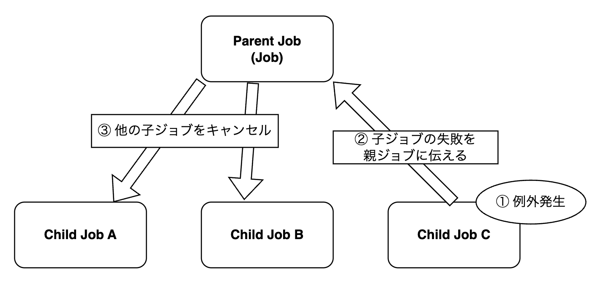
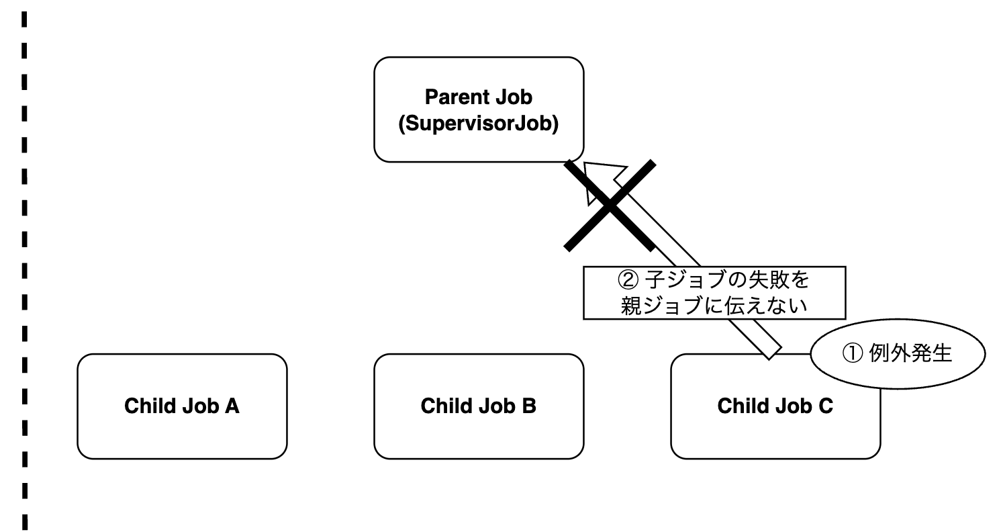
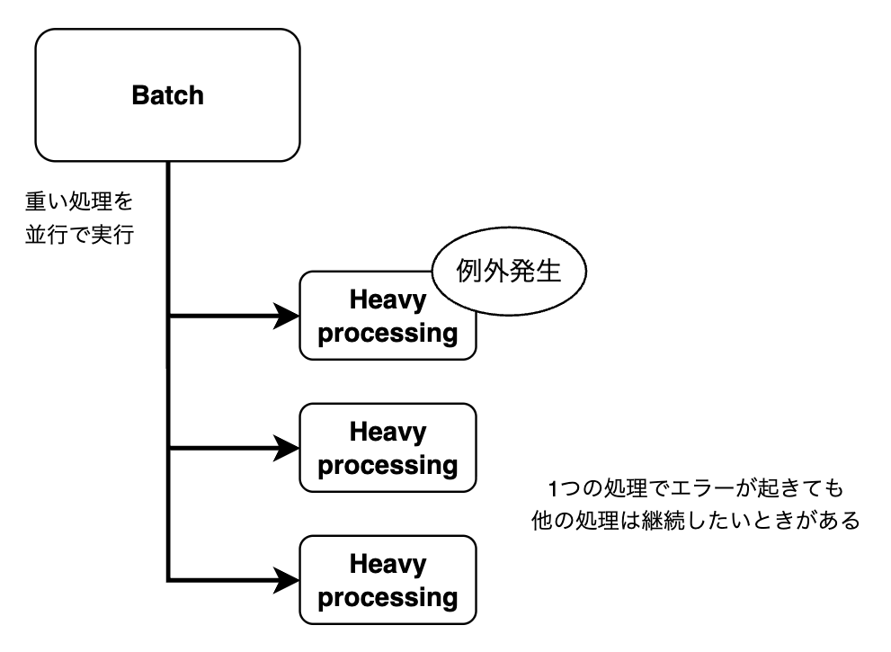
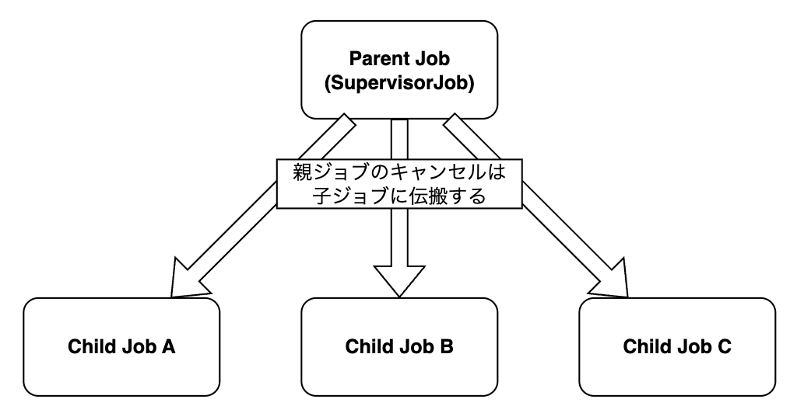
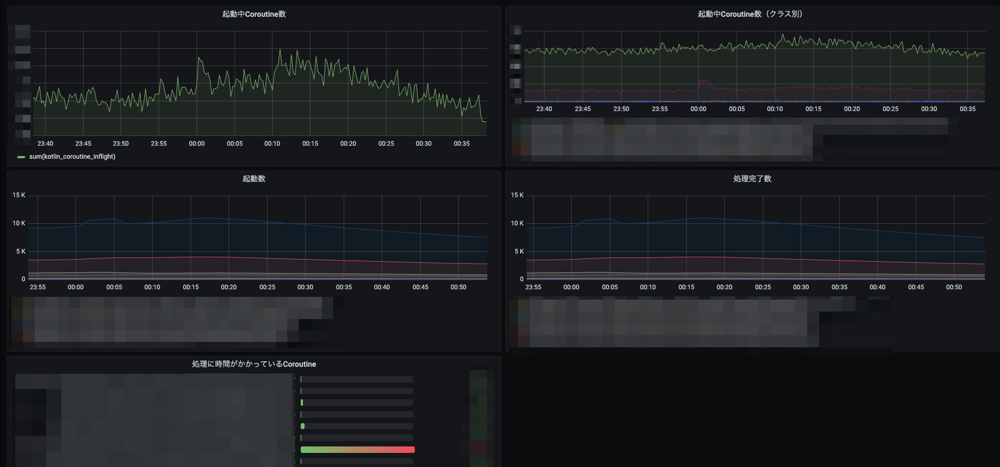

<!-- {"layout": "title", "freeze": true} -->

# LINEマンガを支えるCoroutine

## Kotlinで挑む3社3様の技術課題<br>@株式会社コドモン 東京オフィス

---

<!-- {"layout": "eye-catch"} -->

# 自己紹介

---

<!-- {"layout": "profile"} -->

▼ 名前

本田 雄亮<br>

▼ 所属企業

LINE Digital Frontier株式会社<br>

▼ Xアカウント

@yyh_gl


---

<!-- {"layout": "content"} -->

# 今日話すこと

LINEマンガは5500万DLを突破し
多くのユーザーにご利用いただいているサービスです。

そんなLINEマンガでは、パフォーマンスやリソース効率の観点から
非同期処理が有効に作用する場面が多々あります。

今日は、非同期処理においてLINEマンガで行っている工夫を紹介します。


---

<!-- {"layout": "eye-catch"} -->

# LINEマンガ内でのルール

---

<!-- {"layout": "content"} -->

# 非同期処理に関する決まりごと

LINEマンガの非同期処理に関するADRから一部抜粋。

- **MUST**: Coroutine（kotlinx.coroutines）を使用
- **SHOULD**: `MangaScope`を使用
<br>

KotlinでCoroutineを使うことは（基本的には）当たり前。
今日は`MangaScope`に焦点を当てて紹介します。

---

<!-- {"layout": "eye-catch"} -->

# 本発表の主役『MangaScope』

---

<!-- {"layout": "content"} -->

# `MangaScope`とは？

LINEマンガで使用が推奨されている共通`CoroutineScope`。
<br>
▼ `MangaScope`に関する4つのポイント

1. **Dispatchers.IO**: DB操作といったブロッキングI/Oを安全に実行
2. **SupervisorJob**: 1つの子ジョブの失敗が他の子ジョブに影響を与えない
3. **Graceful Shutdown**: 安全なシャットダウン 
4. **Observability**: メトリクスやログ出力, トレーシングシステムをサポート

---

<!-- {"layout": "eye-catch"} -->

# 1. Dispatchers.IO

---

<!-- {"layout": "content"} -->

# `Dispatchers.IO`ベースのScope

**ブロッキングI/Oに最適化されたスレッドプール**内でコルーチンを実行。

LINEマンガの処理には多くのブロッキングI/Oが存在する。
例えば、DB操作や外部APIへのリクエスト、ファイル操作など。
<br>
`Dispatchers.IO`は、`Dispatchers.Default`とスレッドを共有しており、
**不要なコンテキストスイッチやスレッド生成が行われにくい**
というメリットがある。
（論理的には`Dispatchers.Default`と分離されている）

<!-- https://kotlinlang.org/api/kotlinx.coroutines/kotlinx-coroutines-core/kotlinx.coroutines/-dispatchers/-i-o.html -->
<!-- https://kotlinlang.org/api/kotlinx.coroutines/kotlinx-coroutines-core/kotlinx.coroutines/-coroutine-dispatcher/ -->

---

<!-- {"layout": "eye-catch"} -->

# 2. SupervisorJob

---

<!-- {"layout": "content", "freeze": true} -->

# `SupervisorJob`の基本

通常の`Job`では、子ジョブが1つ失敗すると**他の全子ジョブもキャンセル**される。
`SupervisorJob`は**子の失敗が他の子ジョブに影響を与えない**。




<!-- https://kotlinlang.org/api/kotlinx.coroutines/kotlinx-coroutines-core/kotlinx.coroutines/-supervisor-job.html -->
<!-- https://kotlinlang.org/api/kotlinx.coroutines/kotlinx-coroutines-core/kotlinx.coroutines/-job/ -->

---

<!-- {"layout": "content-with-comment", "freeze": true} -->

# `SupervisorJob`を使う理由

例えば、
重い処理を複数実行するバッチがあるとする。
ひとつの処理（ジョブ）が失敗しても、
他の処理は継続したいときがある。

## たまにあるよね



---

<!-- {"layout": "eye-catch"} -->

# え、じゃあエラーが起きても<br>無視するの？

---

<!-- {"layout": "content"} -->

# 無視しないこともできる

1つのジョブでエラーが起きたら、他のジョブをキャンセルしたいときもある。
そんなときは親ジョブをキャンセルしてあげればよい。



---

<!-- {"layout": "content"} -->

# 無視しないこともできる

最終的にキャンセルはするけど
<u>今実行している処理が終わるまで待ちたい</u>ときもある。

↑ Graceful Shutdownじゃない…？

---

<!-- {"layout": "eye-catch"} -->

# 3. Graceful Shutdown

---

<!-- {"layout": "content"} -->

# CoroutineをGraceful Shutdown

`MangaScope`は**CoroutineのGraceful Shutdownに対応**している。
<br>
つまり、実行中のCoroutineについては
処理が終わるまで （できる限り）待機したうえでcloseできる。

---

<!-- {"layout": "content"} -->

# 処理終了までの3ステップ

1. 新規ジョブの起動を拒否
2. 実行中の子ジョブを1つずつ`join` → 完了待ち
3. supervisorJob.cancel()により残存ジョブをキャンセル

※ 2の処理以降、deadlineを超過した時点ですべての処理を強制終了

---

<!-- {"layout": "content"} -->

# 処理終了までの3ステップ

1. 新規ジョブの起動を拒否
2. <u>**実行中の子ジョブを1つずつ`join` → 完了待ち**</u>
3. supervisorJob.cancel()により残存ジョブをキャンセル

※ 2の処理以降、deadlineを超過した時点ですべての処理を強制終了

---

<!-- {"layout": "content"} -->

# ステップ2の実装イメージ

\> <u>実行中の子ジョブを1つずつ`join` → 完了待ち</u>

`select`で「子ジョブの完了」と「タイムアウト」を**非同期に競争**させる。

```kotlin
while (true) {
    val first = supervisorJob.children.firstOrNull()
        ?: break

    val timeout = select<Boolean> {
        first.onJoin { false }
        onTimeout(deadline.toEpochMilli() - clock.millis()) { true }
    }
    if (timeout) {
        log.error { "..." }
        break
    }
}
```

---

<!-- {"layout": "content"} -->

# AutoCloseableとSpring連携

`MangaScope`は、`AutoCloseable`を実装しており`close`関数を提供。
`close`関数にてGracefulなShutdownを提供。<br>

Spring Beanとして登録すれば
**サーバーシャットダウン時に自動で`close`関数が呼ばれる**。

つまり、**CoroutineのGraceful ShutdownをSpringが自動実行してくれる**。

---

<!-- {"layout": "eye-catch"} -->

# 4. Observability

---

<!-- {"layout": "content"} -->

# `MangaScope`がObservabilityを提供

`MangaScope`は各種メトリクス収集の仕組みを提供。
加えて、分散トレーシングもサポート。

`launchWithMetrics`および`asyncWithMetrics`という2つの関数により実現。

---

<!-- {"layout": "content"} -->

# `xxxWithMetrics`がやること

`launchWithMetrics`および`asyncWithMetrics`は
それぞれ`CoroutineScope.launch`と`CoroutineScope.async`の実行に加え
下記処理のためのセットアップを行う。

- メトリクス収集
  - コルーチンの開始回数
  - コルーチンの終了回数
  - 現在実行中のコルーチン数
  - コルーチンの実行時間
- 分散トレーシング

---

<!-- {"layout": "content"} -->

# 収集したメトリクスを可視化

非同期処理が絡む不具合は、即座にエラーにならず**静かに蓄積**する。
そして、ある日突然、CPU負荷上昇やメモリ枯渇として顕在化。
メトリクスの可視化によりこうした問題を早期発見できる。



---

<!-- {"layout": "eye-catch"} -->

# Coroutineに潜む課題

---

<!-- {"layout": "content"} -->

# ThreadLocal消失問題

Coroutineの実行は複数のスレッドをまたぐ可能性がある。
したがって、基本的には**ThreadLocalが使えない**。
<br>
`MangaScope`は3つの情報をThreadLocalで共有したい。
＝ Coroutineではスレッドを超えて扱いたい。

- SLF4J MDC
- 分散トレーシング情報（Zipkin）
- LINEマンガ独自情報

---

<!-- {"layout": "content"} -->

# 情報のスレッド超え

`MangaScope`では **`CoroutineContext`を使って**
**スレッドをまたいだ情報共有を実現**。
<br>
例えば、SLF4JのMDCは`MDCContext`という
コンテキスト（`ThreadContextElement`）を提供している。

`MDCContext`を`MangaScope`の`CoroutineContext`にセットすれば
MDC情報をスレッドを超えて参照できる。

<!-- https://kotlinlang.org/docs/coroutine-context-and-dispatchers.html -->
<!-- https://kotlinlang.org/api/kotlinx.coroutines/kotlinx-coroutines-core/kotlinx.coroutines/-thread-context-element/ -->

---

<!-- {"layout": "content"} -->

# 情報のスレッド超え
　
```kotlin
private fun threadLocalContext() =
    MDCContext() +
    MangaThreadContextElement() +
    zipkinThreadLocal.asContextElement()
```

```kotlin
override val coroutineContext: CoroutineContext
    get() {
        if (shuttingDown) {
            error("Scope is under shutting down")
        }
        return Dispatchers.IO + threadLocalContext() + customContext + supervisorJob
    }
```

---

<!-- {"layout": "eye-catch"} -->

# まとめます

---

<!-- {"layout": "content"} -->

# まとめ

▼ **`MangaScope`を提供**: 共通`CoroutineScope`の使用を推奨
- **Dispatchers.IO**: ブロッキングI/Oに最適化されたスレッドプールで<br>              　      効率的に非同期処理
- **SupervisorJob**: 開発者が細かく制御できる余地を残す
- **Graceful Shutdown**: GracefulなCoroutine closeを実現
- **Observability**: メトリクス/トレースを自動化

**Coroutine使用時に起きがちな問題を防止。**
**不具合が混入しても早期発見できるようにしている。**

---

<!-- {"layout": "bye"} -->

# ご清聴ありがとうございました！
