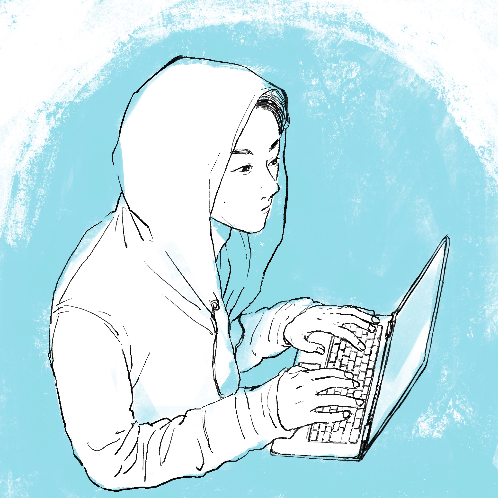

<!-- {"layout": "title"} -->

# 祈るテストから、探索するテストへ

## 〜Lincheckではじめる並行処理テスト〜

---

<!-- {"layout": "section"} -->

# 自己紹介

## はじめまして

---

<!-- {"layout": "aboutme"} -->

# 自己紹介

## ▼ 名前

本田雄亮

## ▼ 所属企業

LINE Digital Frontier株式会社

## ▼ Xアカウント

@yyh_gl

<!-- https://x.com/yyh_gl -->

---

<!-- {"layout": "section"} -->

# 会社紹介

## ちょっとだけ

---

<!-- {"layout": "aboutcompany"} -->

# LINE Digital Frontier株式会社

3つのサービスを運営中。
私は主に『LINEマンガ』を開発しています📚️

<!-- https://ldfcorp.com/ -->

---

<!-- {"layout": "agenda"} -->

# アジェンダ

1. 再現しない並行処理の不具合
1. なぜ再現しないのか
1. Lincheckのアプローチ
1. suspend関数もテストできる
1. 実演：バグを確実に再現する
1. まとめ

<!-- TODO: agenda確定したらデザイン変える -->

---

<!-- {"layout": "content"} -->

# サンプルコードおよび参考資料

本発表で使用するサンプルコード（Kotlin Playgroundのリンク）や
参考資料のリンクはスライドのスピーカーノートに記載しています。

 

お好きなタイミングでご参照ください。

---

<!-- {"layout": "section"} -->

# 1. 再現しない並行処理の不具合

## 諦めていませんか？
